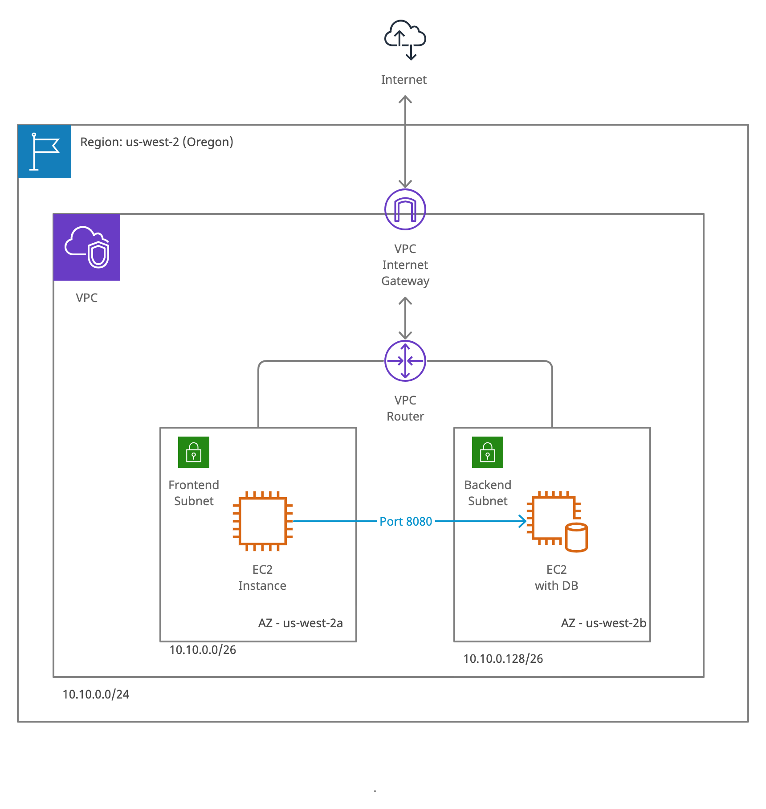

# Ansible Playbook for deploying job-app-tracker on AWS

## Overview

### Pre-requisites: Control Node
1. Install Ansible: `sudo dnf install ansible` on Fedora
2. Install AWS SDK for Python: `pip install boto3 boto`

### Pre-requisites: Environment variables for AWS boto3
1. Enter your AWS_ACCESS_KEY_ID and AWS_SECRET_ACCESS_KEY in the 'keys' file
2. Enter the local path of a SSH key file that matches an existing AWS EC2 Instance Key Pair in the 'keys' file, replacing (KEY_LOCATION_HERE)
3. Execute the export commands by doing `source keys`

### Ansible commands
- `ansible-playbook main.yml` - Creates AWS infrastructure, installs and configures backend and frontend
- `ansible-playbook main.yml --tags create` - Only creates AWS infrastructure
- `ansible-playbook main.yml --tags backend` - Only installs and configures backend
- `ansible-playbook main.yml --tags frontend` - Only installs and configures frontend
- `ansible-playbook main.yml --tags clean` - Deletes AWS infrastructure

## Infrastructure Diagram

